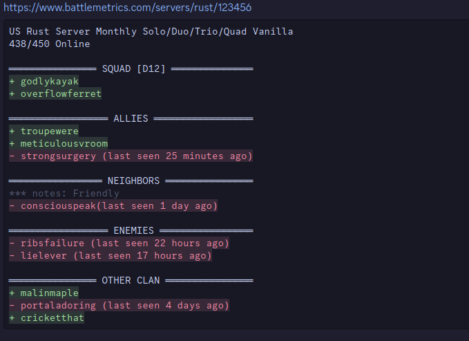

# Rust Game Discord Alerts

**A bot that sends user's online status for the game Rust**

Rust (the game not the language) alerts is a Discord bot that will send a message to a channel with information about what players are online. It uses the Battlemetrics API to get the player list and then checks if the user is online.



## Usage

### Prerequisites

- Requires Go 1.21 or later or Docker.
- Requires a [Discord bot token](https://discord.com/developers/applications).
- Requires a Guild ID (server ID). You can get this by right clicking on the server name and clicking "Copy ID" with developer mode enabled.
- Clone the repository.
- Create a `.env` file in the root directory or add environment variables with the following information:

```env
BOT_TOKEN=<YOUR_BOT_TOKEN, REQUIRED>
GUILD_ID=<YOUR_GUILD_ID, REQUIRED>
LOG_LEVEL=<LOG_LEVEL, optional> [default: INFO]
SAVE_FILE=<SAVE_FILE, optional> [default: ./savefile.json]
```

### Method 1: Manual

```
go build
`./playertrackerbot`
```

I recommend running this as a service so it can run in the background and can auto restart in case of a crash.

### Method 2: Docker

```
docker build -t rust-game-alerts-discord-bot .
```

or

```
docker buildx build -t rust-game-alerts-discord-bot .
```

To Run:

```
 docker run -d -v playertracker-data:/data --env-file .env -e SAVE_FILE=/data/savefile.json --name discord-playertracker rust-game-alerts-discord-bot
```

**Note:** After testing and verifying it starts up, it's recommended to add `--restart unless-stopped` to the docker run command after the `-d` to ensure the bot restarts if the container crashes.

### Method 3: Docker Compose

Ensure that your .env file has a BOT_TOKEN and GUILD_ID set. LOG_LEVEL is optional, and SAVE_FILE is automatically set by the Docker file.

```
docker-compose up --build -d
```

**Note:** Despite what [Docker says](https://docs.docker.com/config/containers/start-containers-automatically/#:~:text=A%20restart%20policy%20only%20takes%20effect%20after%20a%20container%20starts%20successfully.%20In%20this%20case%2C%20starting%20successfully%20means%20that%20the%20container%20is%20up%20for%20at%20least%2010%20seconds%20and%20Docker%20has%20started%20monitoring%20it.%20This%20prevents%20a%20container%20which%20doesn%27t%20start%20at%20all%20from%20going%20into%20a%20restart%20loop.) the restart policy will start spamming immedietly if the bot crashses on startup. So please ensure your BOT_TOKEN and GUILD_ID are correct before running the bot.

## Features

- Automatically updates player's name if they change it.
- Seperate users into groups for easier tracking.
- Add notes and locations to groups for additional information.
- Designed to be non-intrusive and will edit the message instead of spamming the channel.

## Commands

### /start <battle_metrics_server_id, optional>

Starts the tracker. Battle Metrics Server ID is requried to run the first time. If it is not provided, the bot will use the last server ID that was used.

### /stop

Stops the tracker.

### /users add <username(s)> <group>

Adds user(s) to the tracker. Seperate multiple names with a comma. The name doesn't need to be exact and is not case sensitive. The search algorithm prioritizes exact matches first, then names that start with the inputted name, and finally names that contain the inputted name.

### /users add-by-id <battle_metrics_player_id> <group>

Similiar to the add command, but uses the Battle Metrics player ID instead of the player name. Useful when there are players with the same name.

### /users remove <username> <group, optional>

Removes user(s) from the tracker. If a group is provided, it will only remove from that group.

### /users move <username> <group>

Moves a user to a different group.

### /groups add <group_name>

Adds a group to the tracker.

### /groups remove <group_name>

Removes a group from the tracker.

### /groups location <location, optional>

Sets the location of the group. This gets added next to the group name in the tracker. Useful for noting the base location of a group. Running this command without location will remove the location.

### /groups notes <notes, optional>

Sets the notes of the group. This gets added below the group name in the tracker. Useful for adding additional information about the group. Running this command without notes will remove the note.

### /info user <username>

Gets information about a user, including their BattleMetrics profile which will show the times they were on.

### /info group <group_name>

Gets information about a group.

## To Do

- [ ] Add a command to get server data from BattleMetrics
- [ ] Option to send a message when a user logs on/off
- [ ] Connect with Rust+ app to message in chat. (Not sure how possible this is).
- [ ] Predict when a user will be online next.
